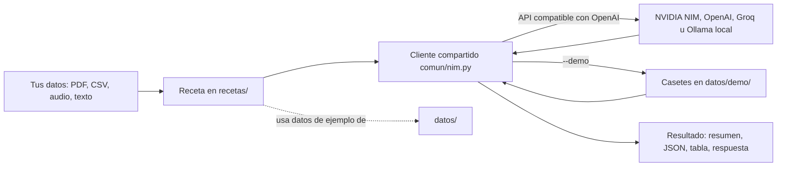
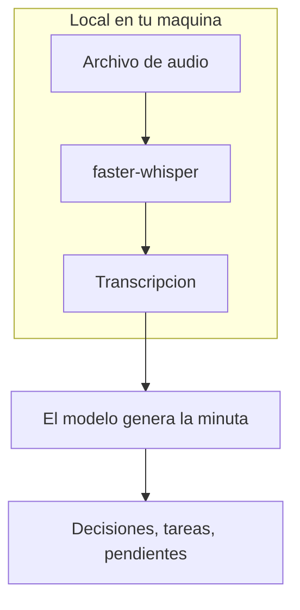

# recetas-ia

**Recetas de IA en español — 15 scripts prácticos y comentados para automatizar trabajo real con la API gratuita de NVIDIA NIM (o cualquier API compatible con OpenAI).**

[](LICENSE)
[](https://www.python.org/)
[](https://build.nvidia.com)
[](#pruebas)
[](#)

Resumir PDFs, clasificar gastos, transcribir audio, responder reseñas, extraer
facturas a JSON, montar un chatbot sobre tus documentos... 15 cosas útiles, cada
una en un script que puedes leer de arriba a abajo y entender. Sin frameworks
pesados, sin magia oculta.

```bash
python recetas.py demo      # las 15 recetas funcionando, sin clave y sin internet
```

---

## Por qué este repo

Casi todo el buen contenido sobre modelos de lenguaje está en inglés: los
tutoriales, la documentación, los ejemplos, los cursos. Un desarrollador
hispanohablante que quiere aprender IA aplicada tropieza con esa barrera antes
incluso de escribir su primera línea de código.

**Este repositorio es la puerta de entrada.** README en español, comentarios en
español, mensajes de consola en español, y ejemplos pensados para la realidad de
LATAM: facturas con RUC e ITBMS, movimientos bancarios con coma decimal,
reseñas de negocios locales. Puedes ver todas las recetas funcionando nada más
clonar (modo demo) y, cuando quieras usar el modelo de verdad, solo necesitas
una clave gratuita de NVIDIA (dos minutos, sin tarjeta) o tu propio servidor
local.

Y cuando una receta se te quede corta, la sección [**de receta a producto**](#de-receta-a-producto)
te enlaza los repositorios hermanos donde cada idea crece hasta algo serio.

---

## Pruébalo sin clave (modo demo)

```bash
git clone https://github.com/AleBrito124356/recetas-ia.git
cd recetas-ia
python -m venv .venv
source .venv/bin/activate        # en Windows:  .venv\Scripts\activate
pip install -r requirements.txt

python recetas.py                # catálogo de las 15 recetas
python recetas.py demo           # recorre las 15 en modo demo
python recetas.py 05 --demo      # una sola receta en modo demo
```

En modo demo (`--demo` o la variable `NIM_DEMO=1`) cada receta hace todo su
trabajo real —leer el PDF, parsear el CSV, validar la factura, trocear e
indexar los documentos, ejecutar las herramientas del agente— pero las
respuestas del modelo salen de **casetes grabados** en `datos/demo/` en vez de
la API. Es la técnica estándar para probar aplicaciones con LLM sin gastar
créditos ("record & replay"):

- Cada respuesta se busca por un hash SHA-256 de los mensajes enviados. Si
  cambias el prompt o los datos, no hay respuesta grabada y la receta lo dice:
  **el modo demo nunca inventa contenido**.
- Cada respuesta lleva un campo `origen` honesto. Las que vienen con el repo
  dicen `"redactada a mano"`: las escribió el autor a partir de los datos de
  ejemplo, no son salida de un modelo. La consola lo recuerda en cada receta:
  `[modo demo] respuesta pregrabada (origen: redactada a mano); no es el modelo en vivo.`
- Los embeddings de la receta 08 se calculan en local con un vectorizador de
  n-gramas de caracteres (determinista, sin red). No es semántico como un
  modelo real, pero la búsqueda funciona de verdad sobre cualquier carpeta.
- Con una clave real puedes **grabar tus propias respuestas**:
  `NIM_GRABAR=1 python recetas/05_extraer_facturas.py` guarda la respuesta real
  en el casete con `origen: "grabada de <modelo> el <fecha>"`, y a partir de
  ahí `--demo` la reproduce idéntica.

---

## Cómo funciona

Todas las recetas siguen el mismo patrón. Los datos entran, un cliente
compartido habla con el modelo, y sale un resultado útil:



`comun/nim.py` es la pieza compartida: lee la clave, conecta con el endpoint
que configures, reintenta ante límites de peticiones y, sobre todo, **traduce
cada fallo a un mensaje en español con la solución** (ver
[Cuando algo falla](#cuando-algo-falla)). Cada receta importa de ahí y se
concentra en su tarea. Dos recetas de audio (03 y 14) corren además un modelo
**local** con `faster-whisper`, sin enviar tu audio a ningún servidor.



---

## Quickstart con el modelo real

```bash
# 1. Clonar e instalar (idealmente en un entorno virtual)
git clone https://github.com/AleBrito124356/recetas-ia.git
cd recetas-ia
python -m venv .venv
source .venv/bin/activate        # en Windows:  .venv\Scripts\activate
pip install -r requirements.txt

# 2. Configurar tu clave de NVIDIA NIM
cp .env.example .env             # en Windows:  copy .env.example .env
# abre .env y pega tu clave (empieza con nvapi-)

# 3. Probar la primera receta con los datos de ejemplo incluidos
python recetas/02_clasificar_gastos.py
```

Si ejecutas cualquier receta sin haber puesto la clave, el programa te explica
paso a paso cómo conseguirla (y te recuerda que puedes probarla con `--demo`).

---

## Cómo conseguir la clave de NVIDIA NIM (gratis)

NVIDIA regala créditos para usar modelos de primer nivel como Llama 3.3 70B. El
proceso es rápido y **no pide tarjeta de crédito**:

1. Entra a **[build.nvidia.com](https://build.nvidia.com)**. Verás un catálogo de
   modelos con tarjetas; arriba a la derecha está el botón para crear cuenta.
2. **Regístrate** con tu correo o inicia sesión con Google o GitHub. Solo piden
   confirmar el correo.
3. Elige cualquier modelo, por ejemplo **`llama-3.3-70b-instruct`**. Se abre una
   página con un panel de prueba a la izquierda y, a la derecha, un botón verde
   que dice **"Get API Key"** (Generar clave).
4. Pulsa ese botón. Aparece una ventana con tu clave: una cadena larga que
   **empieza con `nvapi-`**. Cópiala (solo se muestra una vez).
5. Pégala en tu archivo `.env`:
   ```
   NVIDIA_API_KEY=nvapi-tu_clave_real_aqui
   ```

Listo. Esa misma clave sirve para las 15 recetas.

---

## Usar otro proveedor (OpenAI, Groq, Ollama...)

NVIDIA NIM habla el mismo "idioma" que la API de OpenAI, así que cambiar de
proveedor es cuestión de variables en tu `.env`, **sin tocar código**:

| Variable | Para qué sirve | Por defecto |
|---|---|---|
| `NIM_BASE_URL` | Endpoint compatible con OpenAI | `https://integrate.api.nvidia.com/v1` |
| `NIM_API_KEY` | Clave del proveedor (tiene prioridad sobre `NVIDIA_API_KEY`) | — |
| `NIM_MODEL` | Modelo de chat | `meta/llama-3.3-70b-instruct` |
| `NIM_VISION_MODEL` | Modelo de visión (receta 10) | `meta/llama-3.2-90b-vision-instruct` |
| `NIM_EMBED_MODEL` | Modelo de embeddings (receta 08) | `nvidia/nv-embedqa-e5-v5` |
| `NIM_REINTENTOS` | Reintentos ante 429, errores 5xx o de red | `2` |
| `NIM_TIMEOUT` | Segundos máximos por petición | `120` |
| `NIM_DEMO` / `NIM_GRABAR` | Reproducir / grabar casetes del modo demo | apagados |
| `NIM_DEBUG` | Mostrar la traza completa de Python al fallar | apagado |

```bash
# OpenAI
NIM_BASE_URL=https://api.openai.com/v1
NIM_API_KEY=sk-...
NIM_MODEL=gpt-4o-mini
NIM_EMBED_MODEL=text-embedding-3-small

# Ollama en tu propia máquina: no necesita clave
NIM_BASE_URL=http://localhost:11434/v1
NIM_MODEL=llama3.2
NIM_EMBED_MODEL=nomic-embed-text
```

Los endpoints locales (`localhost`, `127.0.0.1`) no piden clave. Los parámetros
propios de NVIDIA para embeddings (`input_type`) solo se envían al endpoint de
NVIDIA, porque otros proveedores los rechazarían. Elige en cada proveedor un
modelo que soporte lo que pide la receta (visión para la 10, embeddings para la
08). Tienes más ejemplos comentados en [`.env.example`](.env.example).

---

## Cuando algo falla

Cualquier error de la API o del modelo termina con un mensaje en español, la
causa probable y qué hacer, y código de salida 1. Nada de trazas de 40 líneas
en inglés. Por ejemplo, con una clave inválida:

```
============================================================
La API rechazo tu clave (error 401: no autorizada).
Revisa NVIDIA_API_KEY (o NIM_API_KEY) en tu .env: puede estar mal copiada, incompleta o revocada. Si hace falta, genera una nueva en https://build.nvidia.com
Detalle del servidor: Authentication failed
============================================================
```

| Situación | Qué ves |
|---|---|
| Falta la clave o es la de ejemplo | Los pasos para conseguirla (y la opción `--demo`) |
| Clave inválida o revocada (401) / sin permiso (403) | Qué revisar en tu `.env` |
| Límite del nivel gratuito (429) | Avisos de reintento en consola y, si persiste, cuánto esperar |
| Modelo inexistente (404) | Qué modelo pediste y dónde cambiarlo (`NIM_MODEL`) |
| Entrada demasiado larga (400/413/422) | La causa y el detalle que mandó el servidor |
| Sin conexión o servidor local apagado | Qué comprobar de la red o de `NIM_BASE_URL` |
| El servidor tarda demasiado | Cómo subir `NIM_TIMEOUT` |
| El modelo no devuelve JSON o devuelve una respuesta vacía | Que vuelvas a intentarlo o pruebes otro modelo |

Si quieres depurar, `NIM_DEBUG=1` muestra la traza completa de Python.

---

## Las 15 recetas

Todas funcionan con un solo comando sobre sus datos de ejemplo (la 03 necesita
tu propio audio; con `--demo` ves su salida sin él). Todas aceptan `--demo` y
`--help`.

| # | Receta | Qué automatiza | Comando |
|---|--------|----------------|---------|
| 01 | `resumir_pdf` | Resumen ejecutivo + puntos clave de cualquier PDF, con map-reduce por rondas para PDFs largos | `python recetas/01_resumir_pdf.py [documento.pdf]` |
| 02 | `clasificar_gastos` | Categoriza movimientos bancarios (coma decimal, `;`, `B/.`, paréntesis) y arma tabla mensual | `python recetas/02_clasificar_gastos.py [--csv banco.csv]` |
| 03 | `transcribir_audio` | Audio a texto en local, gratis, en español | `python recetas/03_transcribir_audio.py audio.mp3` |
| 04 | `responder_resenas` | Borradores de respuesta a reseñas en el tono que elijas | `python recetas/04_responder_resenas.py --tono cercano` |
| 05 | `extraer_facturas` | Texto de factura a JSON validado: líneas, ITBMS/IVA, fecha y cifras contra el original | `python recetas/05_extraer_facturas.py [--estricto]` |
| 06 | `generar_posts` | Un tema a post de LinkedIn + hilo de X + caption de Instagram | `python recetas/06_generar_posts.py ["tu tema"]` |
| 07 | `traducir_subtitulos` | Traduce un `.srt` conservando tiempos, líneas por subtítulo y formato | `python recetas/07_traducir_subtitulos.py [video.srt]` |
| 08 | `chatbot_docs` | RAG mínimo sobre una carpeta de `.md`, con troceado por secciones y caché de embeddings | `python recetas/08_chatbot_docs.py --pregunta "..."` |
| 09 | `analizar_encuesta` | Respuestas abiertas a temas + sentimiento + citas verificadas | `python recetas/09_analizar_encuesta.py` |
| 10 | `describir_imagenes` | Alt-text y descripción de producto con visión | `python recetas/10_describir_imagenes.py [foto.jpg]` |
| 11 | `datos_sinteticos` | Clientes, productos y pedidos de prueba íntegros y reproducibles | `python recetas/11_datos_sinteticos.py --pedidos 25 --semilla 42` |
| 12 | `revisar_texto` | Corrige ortografía y estilo mostrando un diff | `python recetas/12_revisar_texto.py [--texto "..."]` |
| 13 | `email_profesional` | Puntos sueltos a correo profesional es/en, formal/cercano | `python recetas/13_email_profesional.py [--puntos "..."]` |
| 14 | `audio_a_notas` | Transcripción (o audio) a minuta: decisiones, tareas y pendientes | `python recetas/14_audio_a_notas.py` |
| 15 | `agente_basico` | Un agente ReAct mínimo que no se deja engañar por observaciones inventadas | `python recetas/15_agente_basico.py ["pregunta"]` |

Los argumentos entre corchetes son opcionales: sin ellos se usan los archivos
de `datos/`. También puedes lanzarlas por número: `python recetas.py 07 --idioma frances`.

---

## Ejemplos de salida

Estas salidas están copiadas de ejecuciones reales en modo demo: las respuestas
del modelo son las redactadas a mano de `datos/demo/`, y todo lo demás (sumas,
validaciones, búsqueda, herramientas) lo calcula el código de verdad.

**Clasificar gastos** (`02`). Los totales por mes son la suma real de
`datos/movimientos.csv`:

```
Categoria             2026-01     2026-02
-----------------------------------------
Alimentacion          -265.45     -192.35
Transporte             -57.30      -72.50
Servicios              -39.90      -39.90
Salud                 -132.80     -104.50
Entretenimiento        -31.99      -32.99
Educacion              -42.00     -199.00
Ingresos             2,100.00    2,100.00
-----------------------------------------
GASTO TOTAL           -569.44     -641.24
TOTAL NETO           1,530.56    1,458.76
```

**Extraer facturas** (`05`) devuelve el JSON (extracto) y lo valida línea por
línea, impuesto contra tasa y cifras contra el texto original:

```json
{
  "emisor": { "nombre": "DISTRIBUIDORA CENTRAL, S.A.", "ruc_nit": "155612345-2-2021 DV 33" },
  "documento": { "numero": "000148723", "fecha": "2026-02-12", "moneda": "PAB" },
  "subtotal": 276.0,
  "impuesto": { "nombre": "ITBMS", "tasa": 0.07, "monto": 19.32 },
  "total": 295.32
}
```
```
Validacion: todo cuadra (lineas, subtotal, impuesto y total consistentes, y las cifras clave aparecen en la factura).
```

**Chatbot sobre documentos** (`08`) responde citando la fuente. Las
puntuaciones son las del vectorizador local de la demo; con un modelo de
embeddings real serán otras:

```
> Cuanto cuesta el plan Pro?

El plan Pro cuesta 12 USD al mes (02_precios.md). Incluye facturas y clientes ilimitados, hasta 3 usuarios, recordatorios automáticos de cobro, reportes exportables a PDF y CSV, plantillas con tu logo y colores y soporte prioritario por chat (02_precios.md). Si eres estudiante o una organización sin fines de lucro, puedes pedir un 50% de descuento en el plan Pro escribiendo al soporte (03_preguntas_frecuentes.md).

Fuentes: 02_precios.md (0.29), 02_precios.md (0.29), 03_preguntas_frecuentes.md (0.24)
```

**Agente** (`15`): las herramientas se ejecutan de verdad y el modelo solo ve
observaciones reales:

```
[paso 1] Pensamiento: Primero necesito multiplicar 145 por 32 con la calculadora.
[paso 1] Accion: calcular('145 * 32') -> 4640
[paso 2] Pensamiento: El resultado es 4640. Ahora cuento cuantos caracteres tiene.
[paso 2] Accion: contar_letras('4640') -> El texto '4640' tiene 4 caracteres alfanumericos.
[paso 3] Pensamiento: Ya tengo los dos datos que necesitaba.
[paso 3] Respuesta final.

============================================================
145 * 32 = 4640. El resultado tiene 4 caracteres; en realidad son cifras, no letras (4, 6, 4 y 0).
============================================================
```

---

## Lo que cada receta no deja pasar

Los modelos se equivocan de formas previsibles. Cada receta trae una defensa
concreta, visible en el código y cubierta por pruebas:

- **01** — ningún trozo supera el límite, aunque el PDF tenga párrafos
  gigantes; si los resúmenes siguen sin caber, se reduce por rondas.
- **02** — montos `-84,50`, `1.234,56`, `$ -12.30`, `(45.00)` o `B/. 1.500,00`;
  CSV con `;` y BOM de Excel; columnas llamadas Importe o Concepto; lotes de 60
  movimientos por llamada.
- **05** — `validar()` nunca revienta (acepta `null`, números como texto, tasa
  7 en vez de 0.07) y avisa si una línea no cuadra (4 x 18.50 no son 99.00), si
  el impuesto no corresponde a su tasa, si la fecha no existe o si el total no
  aparece en la factura.
- **07** — si el modelo devuelve menos fragmentos, cada hueco se rellena con
  *su* texto original, nunca con el de otro subtítulo.
- **08** — trocea por secciones y párrafos (nunca a mitad de una línea de una
  lista), antepone la ruta de títulos a cada fragmento y guarda los vectores en
  `.cache/embeddings/`: la segunda ejecución no vuelve a pagar embeddings.
- **09** — porcentajes como `"60%"`, `"60"` o `0.6` se normalizan a enteros que
  suman 100; cada cita se busca en las respuestas y se marca si no aparece.
- **11** — la lista puede venir tras una frase o envuelta en
  `{"clientes": [...]}`; precios en texto se convierten; IDs repetidos se
  renumeran; `--semilla` hace los pedidos reproducibles.
- **15** — la API se detiene en `Observacion:`; si el modelo inventa una
  observación, se descarta todo lo que viene después; una `Accion` gana a una
  `Respuesta final` escrita en la misma vuelta; entiende `Acción:` con tilde;
  la calculadora limita exponentes y tamaño del resultado (`9**9**9` devuelve
  un error al instante en vez de colgar el programa).

---

## Estructura del proyecto

```
recetas-ia/
├── recetas.py               # Lanzador: catálogo, una receta o el recorrido demo
├── comun/
│   ├── nim.py               # Cliente compartido: proveedor configurable y errores en español
│   ├── demo.py              # Modo demo: casetes, grabación y embeddings locales
│   └── formatos.py          # Números y textos al estilo LATAM ("1.234,56", "Acción")
├── recetas/
│   ├── 01_resumir_pdf.py
│   ├── ...                  # las 15 recetas, cada una standalone
│   └── 15_agente_basico.py
├── datos/                   # Datos de ejemplo listos para probar
│   ├── informe_ejemplo.pdf  # 01
│   ├── movimientos.csv      # 02
│   ├── resenas.txt          # 04
│   ├── factura_ejemplo.txt  # 05
│   ├── subtitulos_ejemplo.srt   # 07
│   ├── docs/                # 08: 4 documentos de un producto ficticio
│   ├── encuesta.csv         # 09
│   ├── producto_ejemplo.png # 10
│   ├── borrador_ejemplo.txt # 12
│   ├── notas_correo.txt     # 13
│   ├── transcripcion_reunion.txt  # 03 (demo) y 14
│   └── demo/                # Casetes del modo demo (uno por receta)
├── herramientas/
│   ├── generar_ejemplos.py      # Rehace el PDF y el PNG de ejemplo (solo librería estándar)
│   └── escribir_casetes_demo.py # Rehace los casetes "redactados a mano"
├── tests/                   # Pruebas con pytest, todas sin internet
├── .env.example
├── pyproject.toml
├── requirements.txt
└── requirements-dev.txt
```

---

## Pruebas

```bash
pip install -r requirements-dev.txt
python -m pytest
```

La batería (más de 230 pruebas) corre **sin internet y sin clave**, y es en sí
un ejemplo de cómo probar código que usa modelos de lenguaje:

- **Cliente falso** (`tests/conftest.py`): sustituye a la API y devuelve las
  respuestas que la prueba necesita, incluso las raras (`content = None`, JSON
  envuelto en texto, observaciones inventadas).
- **Servidor stub en 127.0.0.1** (puerto aleatorio): responde 401, 429, 404,
  400 o tarda más de la cuenta, para comprobar con la librería `openai` real
  que los reintentos funcionan y que los mensajes salen en español sin traza.
- **Extremo a extremo**: cada receta se ejecuta como proceso aparte en modo
  demo y se comprueban sus resultados (totales del CSV, tiempos del `.srt`,
  invariantes de los pedidos, fuentes del RAG...), además de
  `python recetas.py demo` completo.
- **Audio sin descargar modelos**: `faster-whisper` se sustituye por un módulo
  falso para probar las recetas 03 y 14.
- **Pruebas de regresión** (`-k regresion`): una por cada fallo corregido en
  esta versión, con la misma entrada que lo reproducía.

Verificado con Python 3.14; el código evita sintaxis posterior a Python 3.9.

---

## De receta a producto

Estas recetas son el primer escalón. Cuando una idea funcione y quieras llevarla
a algo serio, estos repositorios hermanos del autor retoman cada tema con
profundidad (están en inglés, el siguiente paso natural del aprendizaje):

- **[nim-free-api-quickstarts](https://github.com/AleBrito124356/nim-free-api-quickstarts)** —
  Los quickstarts mínimos de cada capacidad de NVIDIA NIM en Python, JS y curl.
  El punto de partida si quieres entender la API a fondo.
- **[rag-blueprints](https://github.com/AleBrito124356/rag-blueprints)** —
  El siguiente nivel de la receta 08: 8 arquitecturas de RAG, desde la más simple
  hasta agentic, cada una ejecutable por separado.
- **[nim-agent-lab](https://github.com/AleBrito124356/nim-agent-lab)** —
  El siguiente nivel de la receta 15: 12 patrones de agentes de IA de calidad
  productiva, en Python puro sobre NIM gratis.
- **[python-automation-toolbox](https://github.com/AleBrito124356/python-automation-toolbox)** —
  20 scripts de automatización en Python para la vida real, en la misma línea
  práctica que estas recetas.

---

## Preguntas frecuentes

**¿Necesito tarjeta de crédito?**
No. NVIDIA NIM da créditos gratuitos suficientes para experimentar con todas las
recetas. La cuenta se crea solo con un correo. Y para ver las recetas funcionando
ni siquiera necesitas cuenta: `python recetas.py demo`.

**¿Tengo que saber programar?**
Ayuda saber lo básico de la terminal, pero cada receta se ejecuta con un solo
comando y trae sus propios datos de ejemplo (la 03 necesita tu audio; con
`--demo` ves su salida sin él). Puedes ver resultados sin escribir código.

**¿Puedo usar otro modelo o proveedor?**
Sí. Cambia `NIM_MODEL` en tu `.env` por cualquier modelo del catálogo de NVIDIA,
o apunta `NIM_BASE_URL` a OpenAI, Groq o un servidor local como Ollama (ver
[Usar otro proveedor](#usar-otro-proveedor-openai-groq-ollama)). No hay que
tocar el código.

**¿Mis datos se van a la nube?**
Solo el texto que cada receta manda al modelo para procesar. Las recetas de audio
(03 y 14) transcriben **en local** con `faster-whisper`: el audio nunca sale de
tu computadora. Si usas un servidor local (Ollama, LM Studio), nada sale de tu
máquina; en modo demo, tampoco.

**¿Las respuestas del modo demo son de un modelo real?**
Las que vienen con el repositorio no: están redactadas a mano y cada una lo dice
en su campo `origen`. Si grabas las tuyas con `NIM_GRABAR=1`, esas sí son del
modelo que usaste, con su nombre y la fecha.

**¿Por qué los comentarios sin tildes en algunas partes?**
Los mensajes que se imprimen en consola evitan tildes a propósito para no romperse
en terminales antiguas de Windows. El README y las explicaciones sí las llevan.

**¿Por qué NVIDIA NIM y no otro proveedor?**
Por el nivel gratuito generoso y porque su API es compatible con el formato de
OpenAI: lo que aprendes aquí sirve igual con OpenAI, Groq y muchos otros
cambiando `NIM_BASE_URL`, `NIM_API_KEY` y `NIM_MODEL` en el `.env`.

---

## Contribuir

¿Se te ocurre una receta 16? ¿Encontraste un caso de LATAM que falta cubrir? Los
issues y pull requests son bienvenidos. La idea es que este sea un recurso vivo
para la comunidad hispanohablante.

Antes de abrir un pull request, ejecuta `python -m pytest`. Si cambias un prompt
o un dato de ejemplo, el casete de esa receta deja de coincidir: vuelve a
grabarlo con `NIM_GRABAR=1` y una clave real, o rehaz los redactados a mano con
`python herramientas/escribir_casetes_demo.py 05`.

---

## Licencia

MIT © 2026 Alejandro Brito. Usa, copia y modifica libremente. Ver [LICENSE](LICENSE).
