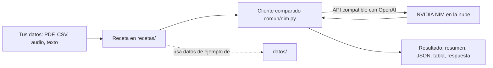
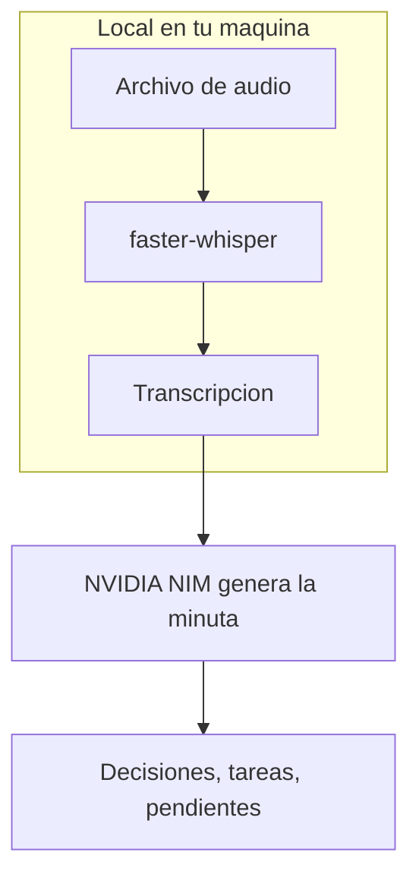

# recetas-ia

**Recetas de IA en español — 15 scripts prácticos y comentados para automatizar trabajo real con la API gratuita de NVIDIA NIM.**

[](LICENSE)
[](https://www.python.org/)
[](https://build.nvidia.com)
[](#)

Resumir PDFs, clasificar gastos, transcribir audio, responder reseñas, extraer
facturas a JSON, montar un chatbot sobre tus documentos... 15 cosas útiles, cada
una en un script que puedes leer de arriba a abajo y entender. Sin frameworks
pesados, sin magia oculta.

---

## Por qué este repo

Casi todo el buen contenido sobre modelos de lenguaje está en inglés: los
tutoriales, la documentación, los ejemplos, los cursos. Un desarrollador
hispanohablante que quiere aprender IA aplicada tropieza con esa barrera antes
incluso de escribir su primera línea de código.

**Este repositorio es la puerta de entrada.** README en español, comentarios en
español, mensajes de consola en español, y ejemplos pensados para la realidad de
LATAM: facturas con RUC e ITBMS, movimientos bancarios en balboas, reseñas de
negocios locales. El código de las recetas está terminado y listo para correr;
lo único que necesitas es una clave gratuita de NVIDIA (dos minutos, sin
tarjeta).

Y cuando una receta se te quede corta, la sección [**de receta a producto**](#de-receta-a-producto)
te enlaza los repositorios hermanos donde cada idea crece hasta algo serio.

---

## Cómo funciona

Todas las recetas siguen el mismo patrón. Los datos entran, un cliente
compartido habla con NVIDIA NIM, y sale un resultado útil:



El archivo `comun/nim.py` es la única pieza compartida: centraliza la conexión,
la lectura de la clave y los mensajes de error en español. Cada receta importa de
ahí y se concentra en su tarea. Dos recetas de audio (03 y 14) corren además un
modelo **local** con `faster-whisper`, sin enviar tu audio a ningún servidor.



---

## Quickstart

```bash
# 1. Clonar el repositorio
git clone https://github.com/AleBrito124356/recetas-ia.git
cd recetas-ia

# 2. Instalar dependencias (idealmente en un entorno virtual)
python -m venv .venv
source .venv/bin/activate        # en Windows:  .venv\Scripts\activate
pip install -r requirements.txt

# 3. Configurar tu clave de NVIDIA NIM
cp .env.example .env             # en Windows:  copy .env.example .env
# abre .env y pega tu clave (empieza con nvapi-)

# 4. Probar la primera receta con los datos de ejemplo incluidos
python recetas/02_clasificar_gastos.py
```

Si ejecutas cualquier receta sin haber puesto la clave, el programa te explica
paso a paso cómo conseguirla. No hay forma de quedarse atascado.

---

## Cómo conseguir la clave de NVIDIA NIM (gratis)

NVIDIA regala créditos para usar modelos de primer nivel como Llama 3.3 70B. El
proceso es rápido y **no pide tarjeta de crédito**:

1. Entra a **[build.nvidia.com](https://build.nvidia.com)**. Verás un catálogo de
   modelos con tarjetas; arriba a la derecha está el botón para crear cuenta.
2. **Regístrate** con tu correo o inicia sesión con Google o GitHub. Solo piden
   confirmar el correo.
3. Elige cualquier modelo, por ejemplo **`llama-3.3-70b-instruct`**. Se abre una
   página con un panel de prueba a la izquierda y, a la derecha, un botón verde
   que dice **"Get API Key"** (Generar clave).
4. Pulsa ese botón. Aparece una ventana con tu clave: una cadena larga que
   **empieza con `nvapi-`**. Cópiala (solo se muestra una vez).
5. Pégala en tu archivo `.env`:
   ```
   NVIDIA_API_KEY=nvapi-tu_clave_real_aqui
   ```

Listo. Esa misma clave sirve para las 15 recetas.

---

## Las 15 recetas

| # | Receta | Qué automatiza | Comando |
|---|--------|----------------|---------|
| 01 | `resumir_pdf` | Resumen ejecutivo + puntos clave de cualquier PDF | `python recetas/01_resumir_pdf.py documento.pdf` |
| 02 | `clasificar_gastos` | Categoriza movimientos bancarios y arma tabla mensual | `python recetas/02_clasificar_gastos.py` |
| 03 | `transcribir_audio` | Audio a texto en local, gratis, en español | `python recetas/03_transcribir_audio.py audio.mp3` |
| 04 | `responder_resenas` | Borradores de respuesta a reseñas en el tono que elijas | `python recetas/04_responder_resenas.py --tono cercano` |
| 05 | `extraer_facturas` | Texto de factura a JSON validado con RUC e ITBMS | `python recetas/05_extraer_facturas.py` |
| 06 | `generar_posts` | Un tema a post de LinkedIn + hilo de X + caption de Instagram | `python recetas/06_generar_posts.py "tu tema"` |
| 07 | `traducir_subtitulos` | Traduce un `.srt` conservando los tiempos | `python recetas/07_traducir_subtitulos.py video.srt` |
| 08 | `chatbot_docs` | RAG mínimo sobre una carpeta de `.md`, explicado paso a paso | `python recetas/08_chatbot_docs.py --pregunta "..."` |
| 09 | `analizar_encuesta` | Respuestas abiertas a temas + sentimiento + citas | `python recetas/09_analizar_encuesta.py` |
| 10 | `describir_imagenes` | Alt-text y descripción de producto con visión | `python recetas/10_describir_imagenes.py foto.jpg` |
| 11 | `datos_sinteticos` | Genera clientes, productos y pedidos de prueba realistas | `python recetas/11_datos_sinteticos.py --pedidos 25` |
| 12 | `revisar_texto` | Corrige ortografía y estilo mostrando un diff | `python recetas/12_revisar_texto.py --texto "..."` |
| 13 | `email_profesional` | Puntos sueltos a correo profesional es/en, formal/cercano | `python recetas/13_email_profesional.py --puntos "..."` |
| 14 | `audio_a_notas` | Transcripción a minuta: decisiones, tareas y pendientes | `python recetas/14_audio_a_notas.py` |
| 15 | `agente_basico` | Un agente ReAct mínimo explicado línea por línea | `python recetas/15_agente_basico.py "..."` |

Todas las recetas con `--help` te muestran sus opciones:

```bash
python recetas/07_traducir_subtitulos.py --help
```

---

## Ejemplos de salida

**Clasificar gastos** (`02`) imprime una tabla lista para leer:

```
Categoria         2026-01     2026-02
--------------------------------------
Alimentacion      -186.90     -149.85
Transporte         -12.30      -24.20
Servicios          -53.89      -56.89
Ingresos          2100.00     2100.00
--------------------------------------
TOTAL             1620.01     1519.81
```

**Extraer facturas** (`05`) devuelve JSON validado:

```json
{
  "emisor": { "nombre": "DISTRIBUIDORA CENTRAL, S.A.", "ruc_nit": "155612345-2-2021" },
  "documento": { "numero": "000148723", "fecha": "2026-02-12", "moneda": "PAB" },
  "subtotal": 276.00,
  "impuesto": { "nombre": "ITBMS", "tasa": 0.07, "monto": 19.32 },
  "total": 295.32
}
```
```
Validacion: la aritmetica cuadra (subtotal, impuesto y total consistentes).
```

**Chatbot sobre documentos** (`08`) responde citando la fuente:

```
> Cuanto cuesta el plan Pro?

El plan Pro cuesta 12 USD al mes e incluye facturas ilimitadas, hasta 3
usuarios, recordatorios automaticos de cobro y reportes exportables
(02_precios.md).

Fuentes: 02_precios.md (0.71), 01_producto.md (0.44)
```

---

## Estructura del proyecto

```
recetas-ia/
├── comun/
│   └── nim.py               # Cliente compartido de NVIDIA NIM (errores en español)
├── recetas/
│   ├── 01_resumir_pdf.py
│   ├── 02_clasificar_gastos.py
│   ├── ...                  # las 15 recetas, cada una standalone
│   └── 15_agente_basico.py
├── datos/                   # Datos de ejemplo listos para probar
│   ├── movimientos.csv
│   ├── resenas.txt
│   ├── factura_ejemplo.txt
│   ├── encuesta.csv
│   ├── transcripcion_reunion.txt
│   ├── subtitulos_ejemplo.srt
│   └── docs/                # 4 documentos de un producto ficticio para el RAG
├── .env.example
├── requirements.txt
└── README.md
```

---

## De receta a producto

Estas recetas son el primer escalón. Cuando una idea funcione y quieras llevarla
a algo serio, estos repositorios hermanos del autor retoman cada tema con
profundidad (están en inglés, el siguiente paso natural del aprendizaje):

- **[nim-free-api-quickstarts](https://github.com/AleBrito124356/nim-free-api-quickstarts)** —
  Los quickstarts mínimos de cada capacidad de NVIDIA NIM en Python, JS y curl.
  El punto de partida si quieres entender la API a fondo.
- **[rag-blueprints](https://github.com/AleBrito124356/rag-blueprints)** —
  El siguiente nivel de la receta 08: 8 arquitecturas de RAG, desde la más simple
  hasta agentic, cada una ejecutable por separado.
- **[nim-agent-lab](https://github.com/AleBrito124356/nim-agent-lab)** —
  El siguiente nivel de la receta 15: 12 patrones de agentes de IA de calidad
  productiva, en Python puro sobre NIM gratis.
- **[python-automation-toolbox](https://github.com/AleBrito124356/python-automation-toolbox)** —
  20 scripts de automatización en Python para la vida real, en la misma línea
  práctica que estas recetas.

---

## Preguntas frecuentes

**¿Necesito tarjeta de crédito?**
No. NVIDIA NIM da créditos gratuitos suficientes para experimentar con todas las
recetas. La cuenta se crea solo con un correo.

**¿Tengo que saber programar?**
Ayuda saber lo básico de la terminal, pero cada receta se ejecuta con un solo
comando y trae sus propios datos de ejemplo. Puedes ver resultados sin escribir
código.

**¿Puedo usar otro modelo?**
Sí. Cambia la variable `NIM_MODEL` en tu `.env` por cualquier modelo del catálogo
de NVIDIA (por ejemplo un modelo más pequeño y rápido) sin tocar el código.

**¿Mis datos se van a la nube?**
Solo el texto que cada receta manda al modelo para procesar. Las recetas de audio
(03 y 14) transcriben **en local** con `faster-whisper`: el audio nunca sale de
tu computadora.

**¿Por qué los comentarios sin tildes en algunas partes?**
Los mensajes que se imprimen en consola evitan tildes a propósito para no romperse
en terminales antiguas de Windows. El README y las explicaciones sí las llevan.

**¿Por qué NVIDIA NIM y no otro proveedor?**
Por el nivel gratuito generoso y porque su API es compatible con el formato de
OpenAI: lo que aprendes aquí sirve igual con OpenAI, Groq y muchos otros
cambiando una sola línea.

---

## Contribuir

¿Se te ocurre una receta 16? ¿Encontraste un caso de LATAM que falta cubrir? Los
issues y pull requests son bienvenidos. La idea es que este sea un recurso vivo
para la comunidad hispanohablante.

---

## Licencia

MIT © 2026 Alejandro Brito. Usa, copia y modifica libremente. Ver [LICENSE](LICENSE).
